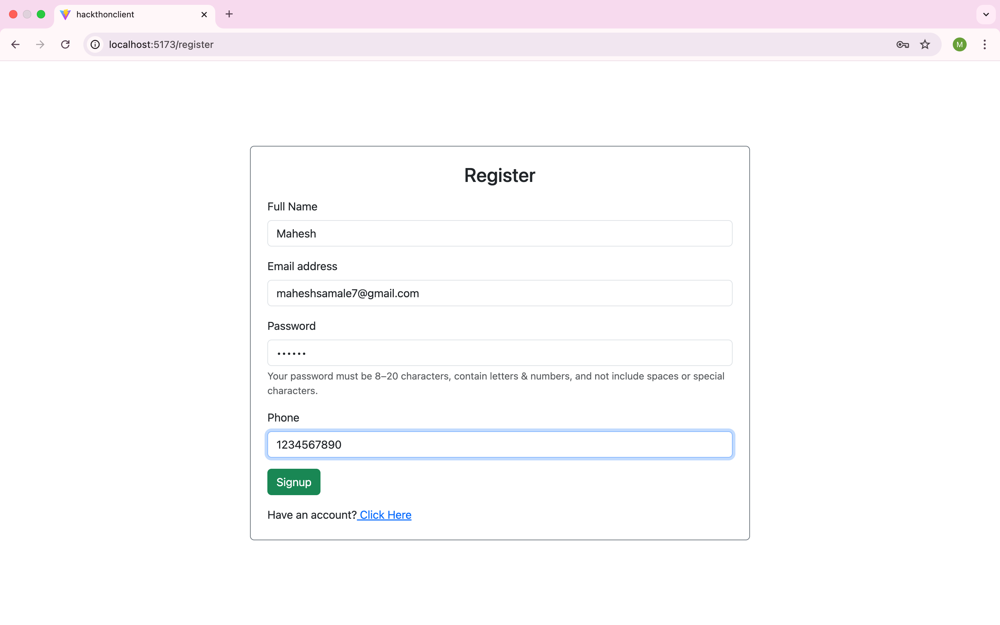
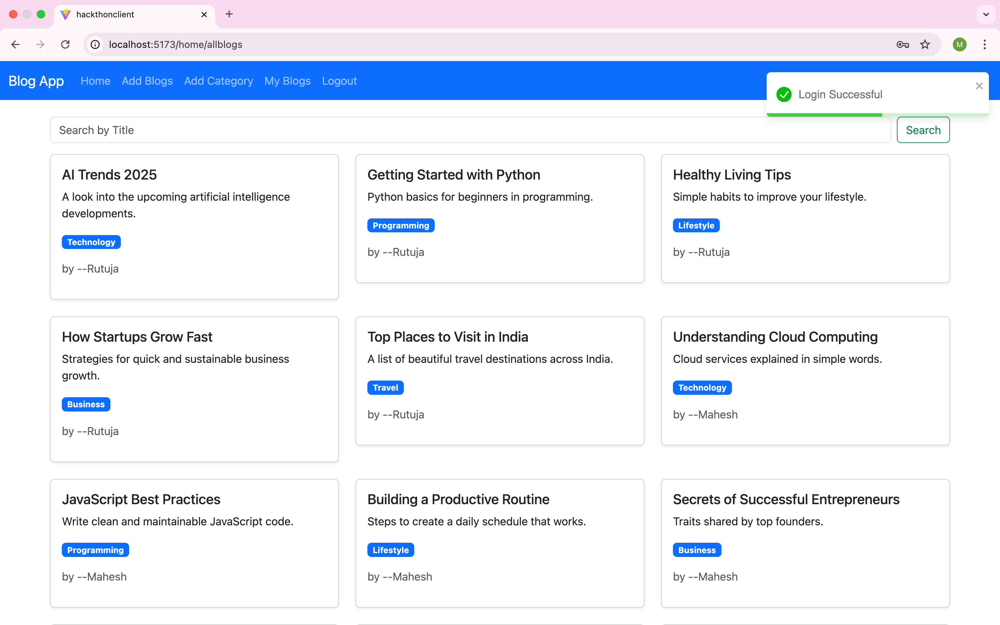

# Blog Management System – Hackathon Project

A full-stack Blog Management System built in 6 hours for a hackathon, using **React**, **Bootstrap**, **Node.js**, **Express**, **MySQL**, and **JWT** authentication.

##  Features

- User registration and login with JWT-based authentication
- Secure profile and session handling
- Add, edit, delete blogs
- Category management (add, edit, delete)
- View all blogs with category labels
- View only “My Blogs”
- Search blogs by title / keyword

##  Tech Stack

- **Frontend:** React, Bootstrap  
- **Backend:** Node.js, Express  
- **Database:** MySQL  
- **Auth:** JSON Web Token (JWT)

##  Screenshots

> Place all these image files in the repository root or adjust the relative paths if you use a folder like `screenshots/`.

### Register

### Register – Success Notification

### Login

### Add New Category

### Edit Category

### Add Blog

### New Blog Added – Toast

### My Blogs – Edit / Delete

### Search Blogs by Keyword

## Build By

- **Mahesh Samale** – [@MaheshSamale](https://github.com/MaheshSamale)  
- **Rutuja Jadhav** – [@Rutuja-coder08](https://github.com/Rutuja-coder08)

